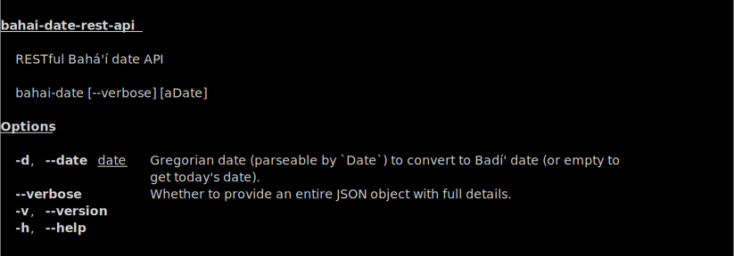

# Baháʼí Date RESTful API

So far, there are three endpoints for this API:

**POST /today**

Returns today's date according to the Baháʼí/Badí' calendar via POST request.

**GET /today**

Returns today's date according to the Baháʼí/Badí' calendar via GET request (as
HTML).

**GET /date**

Given a date from the Gregorian calendar defined via GET data, returns the
corresponding date in the Baháʼí calendar (as JSON).

## Running

To launch the API server, simply navigate to the main folder and type `npm start`.

## Examples

From either endpoint, the output is returned in a similar format: a JSON object containing a message, a Baháʼí calendar date, and a Gregorian date/time.

### Today

URL: localhost:1844/today

```json
{
    "message": "Today is 13 Masá’il 174",
    "badi_date": {
        "year": 174,
        "month": 14,
        "day": 13,
        "month_name": "Masá’il"
    },
    "greg_date": {
        "year": 2017,
        "month": 12,
        "day": 5,
        "hour": 23,
        "minute": 19,
        "second": 12
    }
}
```

### May 23, 1844

URL: localhost:1844/date?year=1844&month=5&day=23&hour=20&minute=45

Output:

```json
{
    "message": "The date is: 8 ‘Aẓamat (Grandeur) 1 B.E.",
    "badi_date": {
        "year": 1,
        "month": 3,
        "day": 8,
        "month_name": "‘Aẓamat (Grandeur)",
        "timezone_id": "Asia/Jerusalem"
    },
    "greg_date": {
        "year": 1844,
        "month": 5,
        "day": 23,
        "hour": 20,
        "minute": 45,
        "second": 0,
        "timezoneOffset": 0
    }
}
```

### February 15, 2014

URL: localhost:1844/date?year=2014&month=2&day=15&hour=13&minute=45

Output:

```json
{
    "message": "The date is: 9 Mulk (Dominion) 170 B.E.",
    "badi_date": {
        "year": 170,
        "month": 18,
        "day": 9,
        "month_name": "Mulk (Dominion)",
        "timezone_id": "Asia/Jerusalem"
    },
    "greg_date": {
        "year": 2014,
        "month": 2,
        "day": 15,
        "hour": 13,
        "minute": 45,
        "second": 0,
        "timezoneOffset": 0
    }
}
```

## CLI usage


